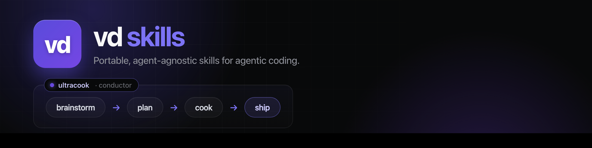

<div align="center">



[](https://github.com/vanducng/skills/actions/workflows/validate.yml)
[](https://skills.vanducng.dev)
[](LICENSE)

**A daily-driver collection of skills for agentic coding** - portable across agents, managed with the **`vd`** CLI.

[**Skill catalog**](https://skills.vanducng.dev/skills/) · [**Install guide**](https://skills.vanducng.dev/install/)

</div>

---

## Install

### Claude Code plugin

```text
/plugin marketplace add vanducng/skills
/plugin install vd@vd-skills
```

Update with `/plugin marketplace update vd-skills && /plugin install vd@vd-skills` · uninstall with `/plugin uninstall vd@vd-skills`.

### vd CLI

```sh
brew install vanducng/tap/vd                                   # macOS
go install github.com/vanducng/vd-cli/v2/cmd/vd@latest         # any platform
```

### Codex

```sh
vd install codex                # user scope
vd install codex --scope repo   # repo scope
```

For Claude Code development symlinks instead of the marketplace plugin: `vd install claude --dev`.

> **Don't mix the two for the same skill.** A marketplace plugin copy and a `--dev` symlink of the same skill shadow each other unpredictably (edits to one won't "land"). Pick one. Diagnose duplicates with `bash scripts/check-install-conflicts.sh`.

> Full install matrix, prerequisites, and troubleshooting → **[skills.vanducng.dev/install](https://skills.vanducng.dev/install/)**

## What's inside

Skills share one build pipeline - **interview → brainstorm → plan → cook → ship** - with `vd:wayfinder` when the deciding will not fit one session, alongside review, research, debugging, diagramming, browser automation, data and workspace tooling, and more. Each skill is a self-contained directory under `skills/<name>/` with a `SKILL.md`.

> Browse the full catalog with "use this when" guidance → **[skills.vanducng.dev/skills](https://skills.vanducng.dev/skills/)**

## Contribute a skill

```sh
bash scripts/new-skill.sh my-new-skill
$EDITOR skills/my-new-skill/SKILL.md
bash scripts/validate.sh
```

Conventional commits drive automated releases (Release Please). Contributor workflow and repo conventions live in [`AGENTS.md`](AGENTS.md) and the **[development guidelines](https://skills.vanducng.dev/development-guidelines/)**.

## License

[MIT](LICENSE)
