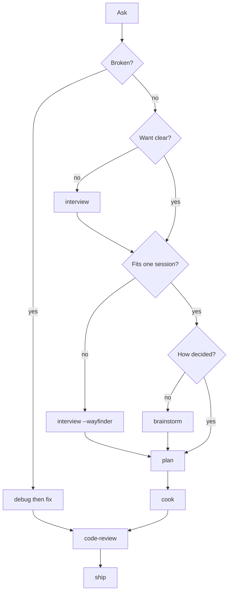

Use the repo as either a published plugin catalog or a local skills workbench.

## Use A Published Skill

1. Install the catalog for your host from [Install](/install/).
2. Pick a canonical skill ID from [Skills](/skills/).
3. Invoke the skill in your agent UI.

Common entries:

| Goal | Skill |
| --- | --- |
| Align on what to build | `vd:interview` |
| Stress-test a plan or idea | `vd:interview --grill` |
| Scout a codebase | `vd:scout` |
| Debug a failure | `vd:debug` |
| Explore one-session approaches | `vd:brainstorm` |
| Chart a multi-session effort | `vd:interview --wayfinder` |
| Plan a multi-step change | `vd:plan` |
| Execute a plan | `vd:cook` |
| Ship a branch | `vd:ship` |
| Update docs | `vd:docs` |

Source: `skills/<name>/SKILL.md` frontmatter.

## From ask to ship

One spine: **interview → brainstorm → plan → cook → ship**. Interview flags only change how you enter it.

| If | Use |
| --- | --- |
| Who / why / success / out of scope is missing | `vd:interview` |
| You have a plan to stress-test | `vd:interview --grill` |
| Deciding will not fit one session | `vd:interview --wayfinder` |
| Want is clear, how is not | `vd:brainstorm` |
| Approach is picked | `vd:plan` → `vd:cook` → `vd:code-review` → `vd:ship` |
| Something is broken | `vd:debug` → `vd:fix`, then review and ship |



`--wayfinder` stays on interview until one chunk is clear, then that chunk joins at `plan` and ships like anything else. `vd:ultracook` runs the smallest slice of this same path.

## Edit A Skill

```sh
bash scripts/new-skill.sh my-skill
$EDITOR skills/my-skill/SKILL.md
bash scripts/validate.sh
```

:::note[Important]
Skill directory names are kebab-case and must match the `name` field in `SKILL.md`. The validator enforces this in `scripts/validate.sh`.
:::

## Sync Vendored Skills

`browser` and `browser-trace` are tracked from `browserbase/skills`, and `ego-browser` from `citrolabs/ego-lite`, in `skills.toml`. Use `vd` to inspect and update tracked sources:

```sh
vd list
vd sync
vd doctor
```

`vd doctor` reports tracked drift plus hand-authored or detached skills. In this repo, most `skills/*` directories are intentionally untracked local catalog entries.

## Release Changes

Use Conventional Commits. Release Please watches `main` and opens a release PR that keeps the skill-catalog version files aligned:

```text
version.txt
skills.toml
.claude-plugin/plugin.json
.claude-plugin/marketplace.json
CHANGELOG.md
```

Source: `.github/workflows/release.yml`, `.release-please-config.json`, `scripts/check-release-versions.sh`.
