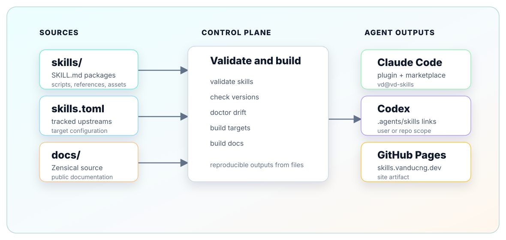

---
hide:
  - path
  - toc
---

# System Architecture

{ .vd-architecture-diagram }

## Components

| Component | Responsibility | Source |
| --- | --- | --- |
| `skills/` | Hand-authored skill packages. Each package has `SKILL.md` and optional local resources. | `skills/*/SKILL.md` |
| `skills.toml` | Declares tracked upstream skill sources and target build settings. | `skills.toml` |
| `vd` CLI | Syncs tracked skills, checks drift, and emits agent surfaces. | `vanducng/vd-cli`, `README.md` |
| `.claude-plugin/` | Claude Code plugin and marketplace manifests for the `vd` plugin. | `.claude-plugin/plugin.json`, `.claude-plugin/marketplace.json` |
| `.agents/skills` | Codex repo-scope discovery links generated by `vd build` or `vd install codex --scope repo`. | `vd install codex --scope repo --dry-run` |
| `docs/` | Zensical source docs for `skills.vanducng.dev`. | `zensical.toml`, `docs/*.md` |
| `.github/workflows/` | Validation, Release Please, and GitHub Pages deployment. | `.github/workflows/*.yml` |

## Data Flow

1. Authors edit `skills/<name>/SKILL.md`.
2. `scripts/validate.sh` checks skill metadata and canonical skill ID conventions.
3. `vd doctor` reports drift between tracked sources, the lock, and local skill directories.
4. `vd build` emits Claude Code plugin metadata and Codex repo-scope links from `skills.toml`.
5. Release Please updates the skill-catalog SemVer surfaces.
6. Zensical builds `docs/` into `site/` for GitHub Pages.

## Version Boundaries

The skill catalog and the `vd` CLI are separate products:

- Skill catalog version: `version.txt`, `skills.toml`, `.claude-plugin/plugin.json`, `.claude-plugin/marketplace.json`.
- CLI version: `vanducng/vd-cli` releases, currently verified locally as `vd 2.1.0`.

`scripts/check-release-versions.sh` enforces only the skill-catalog version boundary.

## Trust Boundaries

Tracked upstream skills are declared in `skills.toml` and inspected with `vd diff` or `vd doctor` before changing local files. Hand-authored local skills are treated as catalog-owned source. GitHub Actions validates metadata before merge and deploys docs only from `main`.
