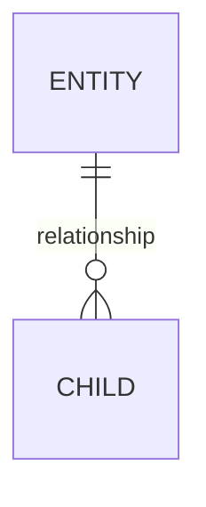

# Database Design Document Template

Use this template when the user asks for a database design document, schema proposal, or reviewable handoff.

````markdown
# {Database Or Feature Name} Database Design

_Date: {YYYY-MM-DD} - Status: Draft_

## Summary
- **Engine:** {PostgreSQL/MySQL/SQLite/D1/BigQuery/MongoDB}
- **Workload:** {OLTP/OLAP/ETL/mixed}
- **Purpose:** {one paragraph}
- **Main decision:** {one sentence}

## Requirements
| Requirement | Notes | Priority |
|---|---|---|
| {requirement} | {detail} | {High/Medium/Low} |

## Existing Schema
- `{table}` - {how it is reused or changed}
- Gaps: {missing concepts}

## Data Model


## Tables
### `{table_name}`
Purpose: {why it exists}

Columns:
| Column | Type | Constraints | Description |
|---|---|---|---|
| `id` | {type} | PK | {description} |

Constraints:
- `{constraint}` - {why}

Indexes:
- `{index}` - supports `{query pattern}`

## Query Patterns
| Query | Frequency | Supporting design |
|---|---|---|
| {query pattern} | {hot/warm/cold} | {index/partition/aggregate} |

## Migration Plan
1. {expand step}
2. {backfill step}
3. {validation step}
4. {contract step}

Rollback: {rollback path or explicit irreversibility}

## Tradeoffs
- {decision}: {why this path wins}
- Rejected: {alternative} because {reason}

## Security And Retention
- Sensitive fields: {fields}
- Retention/deletion: {policy}
- Tenant boundary: {strategy}

## Open Questions
- {question}
````

Keep examples generic. Do not paste real secrets, credentials, or raw PII into design docs.
