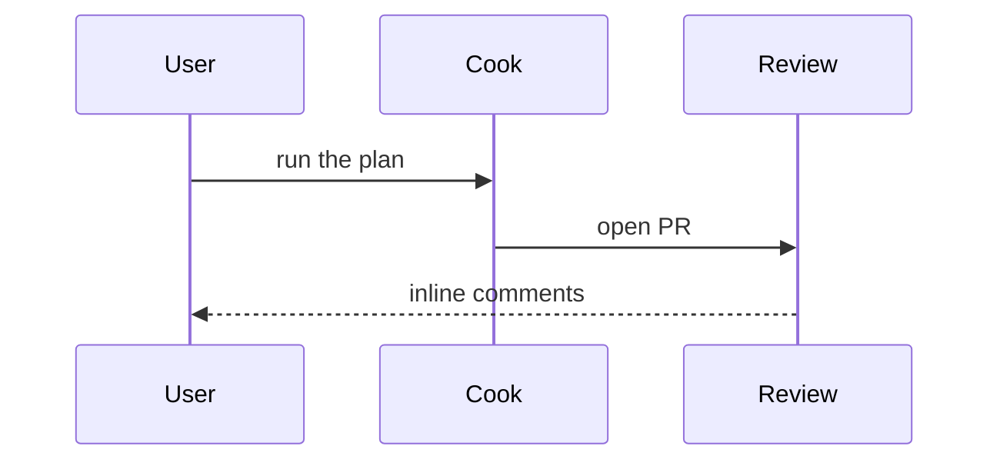

# Show Me

Cheap in-chat visual for the **current** topic. Skip the preamble. Pick the smallest view that makes the key point clear.

This skill can fire anywhere on **interview → brainstorm → plan → cook → ship** when a picture would clarify the question on the table (a decision in brainstorm, a phase in cook, a review comment). It does not replace those skills.

## When not this skill

Hand off. Do not reimplement the heavier visual skills.

| Need | Use |
|---|---|
| Keepable ASCII / box diagram | `vd:text-diagram` |
| Versioned SVG / raster under Visuals or `docs/diagrams` | `vd:diagram` |
| Polished accessible HTML / SVG artifact | `vd:diagram-design` |
| Editable whiteboard | `vd:excalidraw` |
| Bilingual promo / showcase page | `vd:show-off` |
| Designed HTML page | `vd:opendesign` |

HTML from this skill is a throwaway focused view (diagram, infographic, or short slide) only when Mermaid or trees cannot carry the point. Never a showcase site.

## Recipe

1. Skip preamble. Keep prose brief.
2. Pick the smallest view from the patterns below.
3. Place each visual next to the short text it supports.
4. Keep only the calls, files, props, states, and boundaries needed for the current question.
5. Use one pattern, or a few. Do not use all of them.

### Pseudocode

Show logic or an algorithm:

```text
on(checkout)
  if cart is empty
    return
  reserve inventory
  charge payment
  enqueue shipment
```

### Call tree

Show runtime control flow:

```text
cookPhase
  loadPlan
    resolveVisualsPath
  applyPatch
    runTests
  writeJournal
```

### Component tree

Show UI structure, including state and module boundaries that matter:

```tsx
<CheckoutPage> (apps/web/src/routes/checkout.tsx)
  useCart()
  <PaymentForm>
    <CardFields> (packages/billing)
```

### Shallow file tree

Show file responsibility or a broad refactor. Stay shallow:

```text
src/
├── interview/      # extracts want
├── plan/           # writes the implementation path
└── cook/           # applies the plan
```

### Mermaid

Show component interaction, control flow, or data flow:



### Diffs by topic

Use `diff` when the point is what changes and the surrounding shape already exists. Match the diff shape to the topic.

Component change:

```diff
 <CheckoutPage>
   useCart()
   <PaymentForm>
+    <WalletButton />
   <OrderSummary>
+    <PromoField />
```

File-layout change:

```diff
 src/
 ├── interview/
+│   └── grill.ts         # walks existing decisions
 ├── plan/
-└── cook.ts
+└── cook/
+    ├── apply.ts
+    └── verify.ts
```

Call-tree or call-stack change:

```diff
 cookPhase
   loadPlan
     resolveVisualsPath
+    claimFeature
   applyPatch
-  writeJournal
+  writeJournal
+    attachEvidence
```

State or control-flow change:

```diff
 on(checkout)
-  charge payment
+  if cart is empty
+    return
+  reserve inventory
+  charge payment
+  enqueue shipment
```

### Full copyable block

Show the whole block when most of it is new, when omitted context would hide ownership or order, or when the user needs a copyable target shape:

```ts
function nextSkill(stage: string): string {
  if (stage === "want-unclear") return "vd:interview"
  return "vd:brainstorm"
}
```

## Throwaway HTML (last resort)

When the point is a UI, layout, state comparison, or concept too dense for Mermaid or trees, write **one** focused HTML file: a diagram, an infographic, or a short slide. Match known product colors, type, spacing, and components. Use real labels and data. Support desktop and mobile.

Write the file to the hook-injected `Visuals:` path as `show-me-{kebab-description}.html`. If `Visuals:` is unavailable, a temp file is OK. Never construct the artifact layout by hand.

Open it when a local browser is available:

```bash
# macOS
open "$SHOW_ME_HTML"
# Linux
xdg-open "$SHOW_ME_HTML"
```

Do not assume a Claude Code `Bash(open ...)` helper. If no local browser can be launched, give the user the absolute path and a `file://` URL.

## Done when

The current question is visually clear in chat, or the user has an openable path for the one HTML view that needed it.
